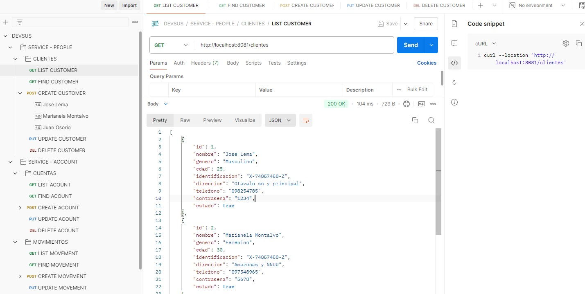

# Guía de ejecución del Proyecto

Este documento proporciona instrucciones para compilar el proyecto Spring Boot, desplegarlo en Docker, y ejecutar pruebas unitarias y pruebas de integración con Karate.

## Índice

1. [Pre-requisitos](#pre-requisitos)
2. [Compilar el Proyecto](#compilar-el-proyecto)
3. [Desplegar en Docker](#desplegar-en-docker)
4. [Ejecutar Pruebas Unitarias y Karate](#ejecutar-pruebas-unitarias-y-karate)
5. [Validar endpoints en Postman](#validar-endpoints-en-postman)

## Pre-requisitos

Antes de comenzar, asegúrate de tener instaladas las siguientes herramientas:

- [Java 17](https://www.oracle.com/java/technologies/javase-jdk17-downloads.html)
- [Maven 3.8.8](https://maven.apache.org/download.cgi)
- [Docker](https://www.docker.com/products/docker-desktop)
- [Docker Compose](https://docs.docker.com/compose/install/)

## Compilar el Proyecto

1. **Clona el repositorio:**

   ```bash
   cd directorio_base
   git clone https://github.com/seniorpe/devsus.git
   
   
2. **Compilar el proyecto usando Maven:**

   ```bash
   cd .\people\
   mvn clean install -DskipTests
   
   cd .\account\
   mvn clean install -DskipTests
   
 Esto descargará las dependencias, compilará el código fuente y ejecutará sin las pruebas unitarias.

## Desplegar en Docker

1. **Asegúrate de que Docker y Docker Compose estén en funcionamiento.**
   
2. **Construye las imágenes Docker e Inicia los contenedores usando Docker Compose:**

   ```bash
   cd directorio_base
   docker-compose up -d --build
   
Esto levantará los servicios definidos en docker-compose.yml, incluyendo la aplicación y la base de datos MySQL.

## Ejecutar Pruebas Unitarias y Karate

1. **Ejecuta los tests:**

   ```bash
   cd .\people\
   mvn test

   cd .\account\
   mvn test
   
Esto ejecutará todas las pruebas unitarias y karate y mostrará un resumen de los resultados.

## Validar endpoints en Postman
1. **Importar la colección a Postman:**
   ```bash
   Importar->Seleccionar fichero DEVSUS.postman_collection.json
   
Al realiza la importacion se tendrá todos los endpoints requeridos.

2. **Screenshot de la colección Postman**




